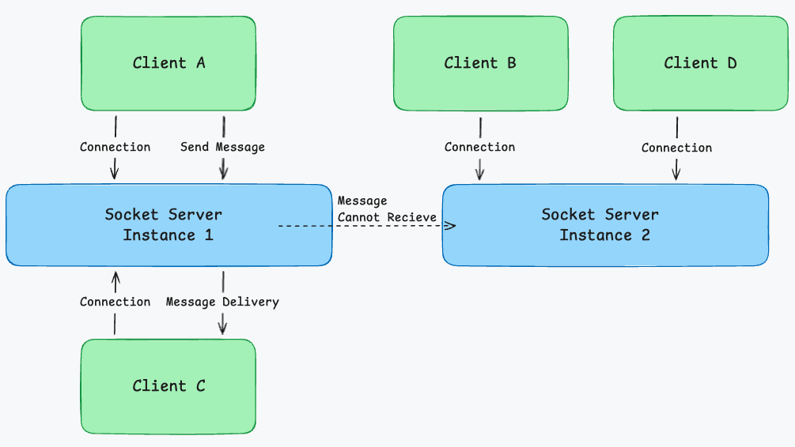
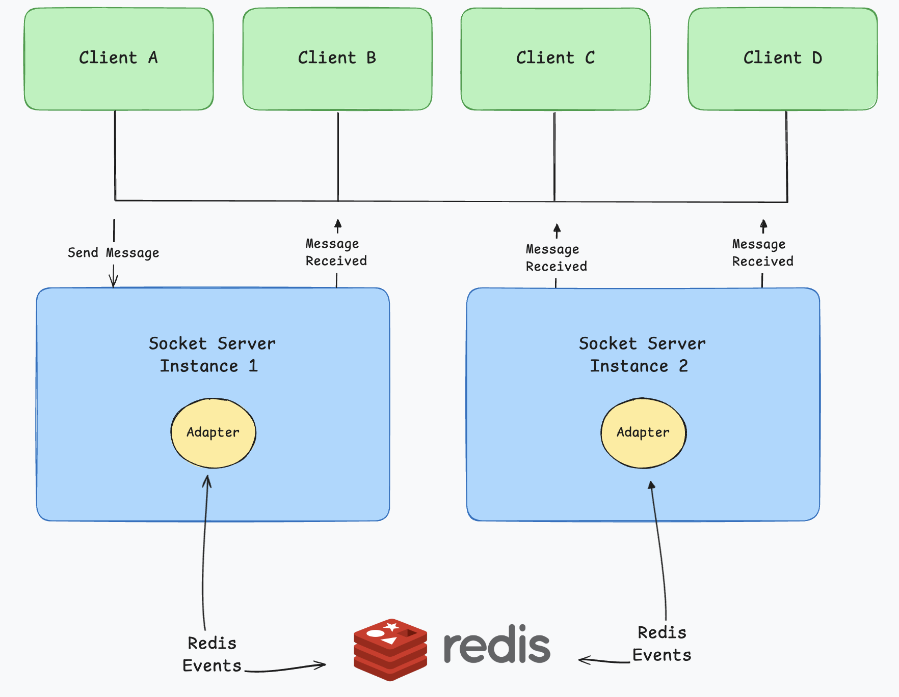
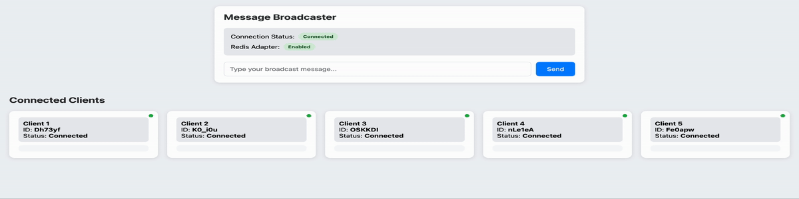

# Building a Multi-Instance Socket.IO Server with Redis Adapter

## Table of Contents

- [Introduction](#introduction)
- [What is the problem of Multi Instance Socket Server?](#what-is-the-problem-of-multi-instance-socket-server)
- [How It Works](#how-it-works)
  - [Redis Adapter Solution](#redis-adapter-solution)
  - [Message Flow with Redis Adapter](#message-flow-with-redis-adapter)
  - [Key Benefits](#key-benefits)
- [Implementation Steps](#implementation-steps)
  - [1. Basic Socket.IO Server Setup](#1-basic-socketio-server-setup)
  - [2. Redis Adapter Integration](#2-redis-adapter-integration)
- [Running the Project](#running-the-project)
- [Testing without Redis Adapter](#testing-without-redis-adapter)
- [Testing with Redis Adapter](#testing-with-redis-adapter)
- [Conclusion](#conclusion)
- [Resources](#resources)
- [Project Structure](#project-structure)
- [Technology Stack](#technology-stack)
- [License](#license)

## Introduction

This guide explains how to build a scalable Socket.IO server that can run multiple instances while maintaining real-time communication between all connected clients. We'll use Redis as a message broker to ensure all subscribers receive messages regardless of which server instance they're connected to.

[⬆ Back to top](#table-of-contents)

## What is the problem of Multi Instance Socket Server?

When running Socket.IO in a multi-instance environment, we face a challenge: messages sent to one instance don't automatically reach clients connected to other instances. Here's why:



Without a message broker:

- Client A connects to Instance 1
- Client B connects to Instance 2
- When Client A sends a message, only clients connected to Instance 1 receive it
- Clients connected to Instance 2 miss the message

Redis Adapter solves this by:

- Acting as a central message broker
- Ensuring all instances receive all messages
- Maintaining real-time communication across all instances

[⬆ Back to top](#table-of-contents)

## How It Works

The Redis Adapter solves the multi-instance communication challenge through a pub/sub (publish/subscribe) messaging pattern. Here's how it works:



### Redis Adapter Solution

- Acts as a central message broker between Socket.IO instances
- Implements pub/sub pattern for real-time message distribution
- Maintains a shared state of all connected clients
- Ensures message delivery to all clients regardless of their connected instance

### Message Flow with Redis Adapter

- When a message is emitted:
  1.  The Socket.IO instance publishes the message to Redis
  2.  Redis distributes the message to all subscribed Socket.IO instances
  3.  Each instance then broadcasts to its connected clients
- This creates a seamless communication layer across all instances

### Key Benefits

- Horizontal scalability: Add more Socket.IO instances without losing messages
- Real-time synchronization across all instances
- Reliable message delivery in distributed environments
- Built-in support for room and private messages

[⬆ Back to top](#table-of-contents)

## Implementation Steps

### 1. Basic Socket.IO Server Setup

```typescript
import express from "express";
import { createServer } from "http";
import { Server } from "socket.io";

const app = express();
const httpServer = createServer(app);
const PORT = process.env.PORT || 3000;
const io = new Server(httpServer);
httpServer.listen(PORT, () => {
  console.log(`Server running on port: ${PORT}`);
});
```

### 2. Redis Adapter Integration

```typescript
import { Redis } from "ioredis";
import { createAdapter } from "@socket.io/redis-adapter";

const redisHost = process.env.REDIS_HOST;
const redisPort = process.env.REDIS_PORT || 6379;
const useRedisAdapter = process.env.USE_REDIS_ADAPTER === "true";

const pubClient = new Redis({ host: redisHost, port: Number(redisPort) });
const subClient = pubClient.duplicate();

const io = new Server(httpServer, {
  adapter: useRedisAdapter ? createAdapter(pubClient, subClient) : undefined,
});
```

[⬆ Back to top](#table-of-contents)

## Running the Project

1. Clone the repository
2. Install dependencies:
   ```bash
   npm install
   ```
3. Start with PM2 or Docker:

   ```bash
   npm run pm2:start
   ```

   or

   ```bash
   docker compose up --build
   ```

4. Go to Browser:
   ```bash
   http://localhost:3000
   ```
5. Stop and Delete all instances:

   ```bash
   npm run pm2:delete
   ```

   or

   ```bash
   docker compose down
   ```

6. Test the application by opening multiple browser windows and sending messages

[⬆ Back to top](#table-of-contents)

## Testing without Redis Adapter

1. Disable Redis Adapter in `.env`:
   ```bash
   USE_REDIS_ADAPTER=false
   ```
2. Start the server
3. Go to Browser


This demonstrates the limitation of running Socket.IO instances without a message broker.

[⬆ Back to top](#table-of-contents)

## Testing with Redis Adapter

1. Enable Redis Adapter in `.env`:
   ```bash
   USE_REDIS_ADAPTER=true
   ```
2. Start the server
3. Go to Browser



This demonstrates how Redis Adapter enables seamless communication across multiple Socket.IO instances.

[⬆ Back to top](#table-of-contents)

## Conclusion

Using Redis Adapter with Socket.IO is essential for building scalable real-time applications that run on multiple instances. It ensures consistent message delivery across all instances and provides a robust foundation for handling large numbers of concurrent connections.

The Redis Adapter provides an elegant solution for scaling Socket.IO applications across multiple instances.

[⬆ Back to top](#table-of-contents)

## Resources

- [Socket.IO Documentation](https://socket.io/docs/v4)
- [Socket.IO Redis Adapter](https://socket.io/docs/v4/redis-adapter)
- [Redis Documentation](https://redis.io/documentation)

[⬆ Back to top](#table-of-contents)

## Project Structure

```
socket-article/
├── src/
│   └── server.ts
├── images/
├── .env
├── .env-example
├── .dockerignore
├── .gitignore
├── client.html
├── docker-compose.yml
├── Dockerfile
├── ecosystem.config.js
├── LICENSE
├── package.json
├── README.md
```

[⬆ Back to top](#table-of-contents)

## Technology Stack

- **Node.js & TypeScript**: For server-side development
- **Socket.IO**: For real-time communication
- **Redis**: As message broker
- **Docker & Docker Compose**: For containerization and orchestration

[⬆ Back to top](#table-of-contents)

## License

MIT License
